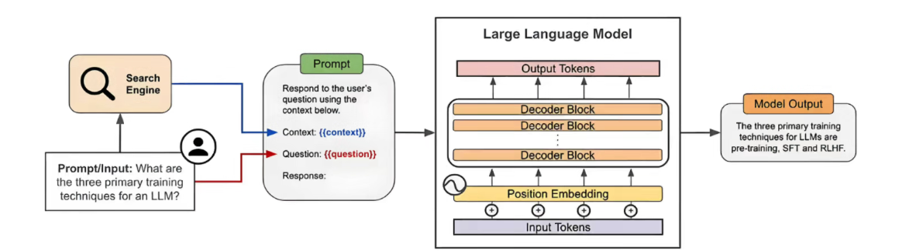
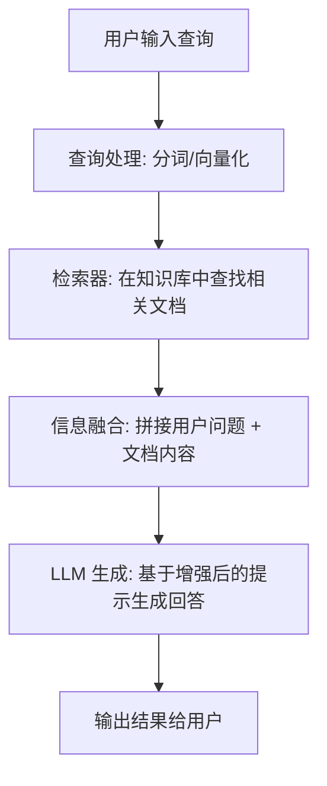

# 一、RAG 理论基础

## 1、大模型的局限性

- 在实际企业应用中，单纯依赖大语言模型（LLM）会面临以下关键问题

### 1.1 常见挑战

#### 1.1.1 “幻觉”问题（Hallucination）

- 大模型可能生成**看似合理但实际错误的内容**，尤其在以下场景更明显：

  - 专业领域知识（金融、医疗、法律等）

  - 企业内部专有数据查询

  - 复杂推理或细节性问题

- 大模型回答的本质：模型基于概率生成，而非真实数据库检索

#### 1.1.2 知识时效性不足

- LLM 的知识来源于训练数据，存在明确时间边界：

  - 无法自动获取最新信息

  - 对实时变化（政策、产品、数据）反应滞后

  - 需要额外更新或重新训练成本高

- 大模型回答的结果：回答“过时信息”风险较高

#### 1.1.3 缺乏可解释性与可追溯性

- 在企业应用中，纯 LLM 属于“黑盒系统”：
  - 无法明确说明答案来源
  - 难以追溯信息依据
  - 不满足审计与合规要求

#### 1.1.4 知识固化问题

- 模型参数是静态的：

  - 难以快速适配企业知识更新

  - 无法灵活接入内部文档或数据库

## 2、企业应用中的核心需求

- 在真实业务场景中，企业对 AI 系统通常有更高要求

### 2.1 数据可信与权威性

- 必须基于企业内部或可信数据源
- 避免“模型猜测”带来的错误决策
- 强调信息来源可验证

### 2.2 知识动态更新能力

- 支持企业知识库持续更新
- 无需频繁重新训练模型
- 能快速适配业务变化（产品、政策、流程）

### 2.3 可解释与可追溯

- 输出结果必须能回溯到原始文档
- 提供引用来源（document grounding）
- 满足合规、安全与审计要求

### 2.4 高精度业务支持能力

- 提升客服、问答、检索系统准确率
- 支持企业级知识问答系统
- 减少人工干预成本

## 3、RAG 的提出背景与作用

- 为解决上述问题，提出了 **RAG（Retrieval-Augmented Generation，检索增强生成）架构**

## 4、RAG 定义

- RAG（Retrieval-Augmented Generation）通过引入**外部知识库**，解决了大模型（LLM）存在的幻觉问题、时效性差以及私有数据匮乏等痛点
  - **检索 (Retrieval)：** 像是在查字典，从海量非结构化数据中精准定位与问题相关的“上下文”
  - **增强 (Augmentation)：** 将搜到的“标准答案参考资料”塞进 Prompt，给 LLM 开卷考试的机会
  - **生成 (Generation)：** LLM 不再盲目猜测，而是基于参考资料进行逻辑归纳和文本润色

## 5、核心思想

- RAG = **检索（Retrieval）+ 生成（Generation）**，通过结合传统的**生成式语言模型**和**动态检索机制**【不再仅依赖模型“记忆”，而是：**先查资料，再回答问题**】，实时从**外部知识库**中检索信息，增强模型的生成输出：

## 6、RAG 工作流程

- 在了解流程前，需要明确 RAG 的底层基础设施：

| **组件**              | **说明**   | **技术关键点**                                     |
| --------------------- | ---------- | -------------------------------------------------- |
| **Embedding Model**   | 向量化模型 | 将文字转为数学向量（如 OpenAI `text-embedding-3`） |
| **Vector Database**   | 向量数据库 | 存储和检索向量（如 Milvus, Pinecone, Weaviate）    |
| **Chunking Strategy** | 分块策略   | 如何切分长文档（固定长度、语义切分、重叠切分）     |
| **Rerank Model**      | 重排序模型 | 对初步检索的结果进行二次精排，提升准确率           |

- 我们将流程细化为两个阶段：**离线数据准备**（摄入）与 **在线检索生成**（推理）
- **离线阶段：知识库构建 (Data Ingestion)**

  1. **文档加载：** 读取 PDF, Markdown, Word 等原始格式
  2. **文本切分 (Chunking)：** 将长文切成 300-500 字的片段，并保留一定的 **Overlap（重叠度）** 以维持语义连贯
  3. **向量化 (Embedding)：** 调用模型将每个 Chunk 转为高维向量
  4. **持久化：** 将“向量+原始文本+元数据”存入向量数据库
- **在线阶段：推理与生成 (Inference)**

  1. **用户查询处理：** 对 User Query 进行 Embedding 转化

  2. **向量检索：** 在数据库中执行 **余弦相似度** 或 **欧氏距离** 搜索，获取 Top-k 个片段

  3. **重排序 (Reranking) [推荐增加]：** 使用专门的重排序模型对 Top-k 结果进行相关性打分，过滤掉噪音

  4. **Prompt 构建：** 将检索到的知识按模板拼接

     > **模板示例：** "已知信息：{context}。请根据上述信息回答用户问题：{query}。如果信息不足，请直说不知道。"

  5. **LLM 生成：** 投喂给大模型，生成带有事实依据的回复
- 流程图简化版

## 7、海捞针实验

- 大海捞针实验就是在超长文本中埋入关键事实，用来测试 RAG 系统“能不能真正找到它”，是评估检索能力、抗干扰能力和长上下文理解能力的经典基准方法

## 8、RAG vs LoRA

### 7.1 关键差异

- RAG：依赖外部知识库进行动态检索，以实时更新和扩展模型的知识
- 微调：在特定数据集上调整预训练模型的参数，以提高在特定任务上的表现，不涉及实时检索外部信息

### 8.2 适用场景

- RAG：适用于需要访问和引入大量外部最新信息的场景，如开放域问答、实时内容生成等
- 微调：适合于有大量标注数据且领域相对固定的任务，如情感分析、特定领域的文本分类等

### 8.3 互补性

- RAG 和微调不是相互排斥的，而是相互补充，从不同层面增强模型的能力，结合这两种技术可以实现最佳的模型性能

## 9、RAG 优势

- 准确性：RAG 通过与外部关联内容来提高准确性，减少 LM 幻觉问题，使生成更准确、可靠

- 时效性：RAG 通过关联最新信息，保持响应的时效性

- 透明度：RAG 通过引用来源提高答案的透明度，增加用户对模型的信任

- 定制化能力：RAG 可以通过索引相关语料库，为特定领域提供知识支持

- 可扩展性：RAG 能够处理大规模数据集而无需更新参数

## 10、RAG 挑战

- 准确性依赖：
  - 数据复杂多样：结构化（MySQL）、非结构化、Excel、PDF、PPT、Word
  - 数据的整理、清洗和准确性验证是一个大工程
  - 处理好的数据如何构建知识库：怎么分块，如何高效索引
  - RAG 增强的关键是获得和问题相关的信息，高效保质的检索是关键
- 多上下文相关信息的处理：
  - 如何排序相关信息
  - 如何写合适的 prompt 激发大模型潜能
  - 哪种大模型更合适当前的业务需求

- 计算成本与速度：
  - **RAG 需要在大型知识库或网络中检索，需要计算成本**
- 集成设计与优化：
  - 要实现检索与生成部分的无缝集成，需要精心设计和优化，这在训练和部署过程中带来挑战
- 隐私与合规问题： 
  - 在处理敏感数据时，从外部来源检索信息可能会涉及隐私问题
  - 需遵守隐私和法规要求，限制可访问的信息来源
- 局限性：
  - RAG 擅长处理基于事实的内容生成，不擅长创作富有想象力或虚构性质的内容
