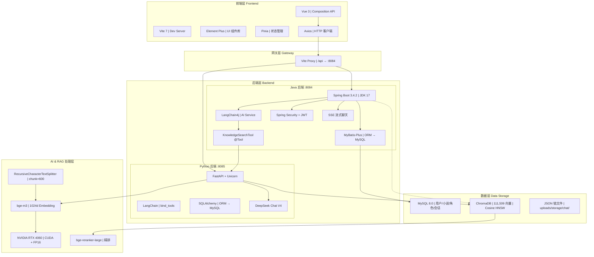

# 功能完成状态

> 最后更新: 2026-06-28

## 已完成功能

| 功能 | 前端 | 后端 | 说明 |
|------|------|------|------|
| 用户认证（登录/注册） | ✅ | ✅ | JWT Token |
| 小说 CRUD | ✅ | ✅ | 列表/创建/编辑/删除 |
| 角色 CRUD | ✅ | ✅ | 列表/创建/编辑/删除 |
| 时间线 CRUD | ✅ | ✅ | 行内编辑 + 下拉切换 |
| 故事节点 CRUD | ✅ | ✅ | 行内编辑 + 类型/重要性 |
| 封面上传 | ✅ | ✅ | MD5 去重，支持 jpg/png/webp/gif |
| 背景图上传 | ✅ | ✅ | MD5 去重，支持 jpg/png/webp，8MB 限制 |
| RAG 智能助手 | ✅ | ✅ | DeepSeek + 向量检索 |
| 共享头部组件 | ✅ | — | NovelPageHeader.vue |
| 共享 CSS 工具类 | ✅ | — | icon-utils.css |

---

## 占位/未完成功能

### NovelEditorView.vue — 小说编辑器

- **状态**: 纯占位页面
- **当前行为**: 显示"小说编辑器功能开发中，敬请期待..."
- **缺失功能**:
  - 富文本/Markdown 编辑器
  - 章节管理（创建/编辑/删除/排序）
  - 内容保存/加载
  - 自动保存
  - 导出功能
- **优先级**: 🔴 高（核心创作功能）
- **建议**: 集成 Tiptap 或 Milkdown 编辑器

### SettingsView.vue — 设置页面

- **状态**: 部分占位
- **占位方法**:
  - `handleExportAll()` — 仅 `alert('导出功能开发中')`
  - `handleExportCharacters()` — 仅 `alert('导出功能开发中')`
- **缺失功能**:
  - 导出全部小说（JSON/ZIP）
  - 导出角色库
  - 修改密码
  - 三方账号绑定
  - 导入功能
  - 版本历史
- **优先级**: 🟡 中

### HomeView.vue — 知识图谱

- **状态**: 空方法
- **占位方法**: `showKnowledgeGraph()` — 仅 `// TODO: 实现知识图谱窗口`
- **优先级**: 🟢 低

### AboutView.vue — 关于页面

- **状态**: 纯静态
- **当前行为**: 仅显示 "This is an about page"
- **优先级**: 🟢 低

---

## 后端已实现但前端未完全使用

| 接口 | 状态 | 说明 |
|------|------|------|
| `POST /novel/update/{id}` | ⚠️ | 前端有 API 定义但未在 UI 中使用 |
| `GET /storyNode/all/{novelId}` | ⚠️ | 仅在 RAG 助手中使用 |
| `GET /storyNode/list/{novelId}` | ❌ | 前端未调用分页版本 |

---

## 已知技术债

1. **SecurityConfig**: 所有接口 `permitAll()`，JWT 认证形同虚设
2. **WebMvcConfig**: 静态资源映射路径需确认与 context-path 的兼容性
3. **NovelServiceImpl**: `updateNovel` 方法 `@Transactional` 无多表操作，可移除
4. **localImages.ts**: LSP 类型错误（`thumb` 可能为 undefined），需修复

